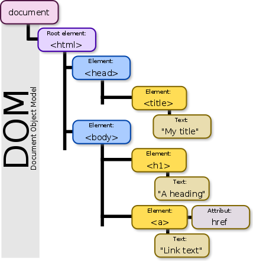

# JS

## Взаимодействие с DOM

JavaScript позволяет взаимодействовать с [DOM - document object model](https://www.w3schools.com/js/js_htmldom.asp).



Каждая страница состоит из элемента document, в котором содержится тег `<html>`, в котором ещё могут присутствовать различные теги.

Поэтому для работы с DOM в javascript всегда используется `document`.

Чтобы начать как-то взаимодействовать с элементом на странице используются встроенные методы `getElementBy`:
самый часто встречаемый: `getElementById`

Также есть: `getElementsByTagName`, `getElementsByClassName`

При помощи JS можно менять, удалять, создавать новые элементы, изменять стили, реагировать на события, происходимые на странице, создавать новые события.

```JavaScript

<html>
    <body onload="myFunction()">
        <h1 id="header">Заголовок</h1>
        <p>Абзац</p>
        <select id="mySelect">
            <option value="1">One</option>
            <option value="2">Two</option>
            <option value="3">Three</option>
        </select>
        <input type="text">
        <button onclick="myFunction2()">Button</button>
    </body>
</html>

<script>
    //получить ссылку на элемент по Id
    var a = document.getElementById("header");
    //изменить текст найденного элемента
    a.innerHTML = "Hello";

    //Код, написанный выше может выполнен и таким образом:
    document.getElementById("header").innerHTML = "Hello";

    //У элементов можно менять атрибуты
    var t = document.getElementById("mySelect");
    //Заменить значение атрибута value у выбранного в select элемента
    t.value = 5;

    //Или аналогичный код (бывает не для всех атрибутов есть возможность сделать так, как указано выше.
    t.setAttribute(value, "5");

    //Для добавления, удаления элементов, изменения может использоваться следующий код:
    //создать элемент, с указанным тегом
    document.createElement("p");
    document.createElement("option");
    //Удаление элемента
    document.removeChild(element);
    //Добавление элемента на страницу (если нужно его создать, как дочерний элемент другого элемента
    document.appendChild(element);

</script>
```

## JS запросы к API

### GET

Для выполнения GET запроса потребуется следующий код:

```JavaScript
//Создание переменной XMLHttpRequest - для создания запроса к удалённому серверу
var xhr = new XMLHttpRequest();
//Тут необходимо вставить собственную ссылку, к которой и будет выполнен запрос
var url = "ENTER_YOUR_URL_HERE";
//Выполнение асинхронного (true) запроса к удалённому серверу методом GET
xhr.open("GET", url, true);
//Сообщаем серверу, что получаем в JSON формате (не обязательная строка, так выполянется и по умолчанию)
xhr.setRequestHeader("Content-Type", "application/json");
//Состояние, которое постоянно проверяет как там дела у нашего запроса
xhr.onreadystatechange = function () {
    //проверяем состояние:
    //0 - open еще не был вызван.
    //1 - open был вызван
    //2 - отправлен send и получензаголовки
    //3 - идёт загрузки
    //4 - операция выполнена
    //и статус, соглашения пстатусам можно найти в сети200 - это всё хорошо
    if (xhr.readyState === 4 && xhr.status === 200) {
        //когда все данныполучены полученуспешно (статус 200, то выполним отдельную функцию, в которой обработаем полученный json.
        // В responseText - содержится весь ответ сервера.
        openJSON(xmlhttp.responseText);
    }
};
//Отправляем запрос на сервер
xhr.send();
```

### POST

POST запрос отличается от GET тем, что необходимо в xhr.send передать параметр - данные, которые будут добавлены в JSON виде.

```JavaScript
//Аналогичный код, как в GET
var xhr = new XMLHttpRequest();
var url = "ENTER_YOUR_URL_HERE";
//Выполняется уже POST запрос
xhr.open("POST", url, true);
xhr.setRequestHeader("Content-Type", "application/json");
xhr.onreadystatechange = function () {
    if (xhr.readyState === 4 && xhr.status === 200) {
        //Тут мы можем точно также, как в GET получить ответ от сервера и каким-то образом его обработать. Что возвращает сервер - зависит от вас. В примерах часто используется только добавленный id, можно его и вернуть
    }
};
//Формируем данные в формате JSON. Для этой операции вам понадобится использовать взаимодействие с DOM, чтобы получить все значения элементов и сформировать из них стркоу
var data = JSON.stringify({"name": "animals1", "species_id": 1});
xhr.send(data);
```

### PUT

Аналогичен POST, только не забудьте поменять метод при `open` и API должен быть с параметром для одного элемента.

### DELETE

Аналогичен GET, только не забудьте поменять метод при `open` и API должен быть с параметром для одного элемента.
